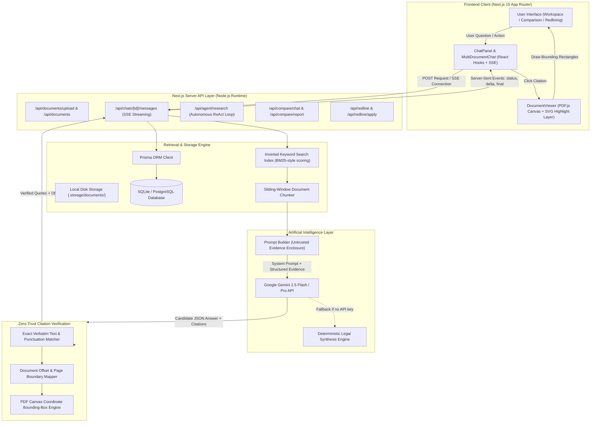
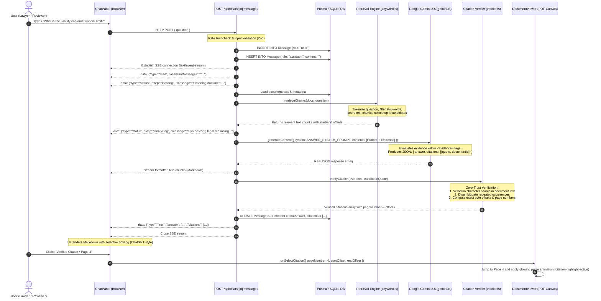

# System Architecture & Backend Data Flow

This document details the end-to-end architecture of **ContractAI**, illustrating how requests flow through the Next.js fullstack application, how the backend orchestrates retrieval, how the Large Language Model (Gemini 2.5) generates candidate legal reasoning, and how the verification engine validates citations before streaming responses to the user.

---

## 1. High-Level Architecture Diagram

---

## 2. End-to-End Sequence Diagram: From User Input to Rendered Answer

This sequence diagram illustrates what happens the moment a user clicks **Send** in the Contract Chat:

---

## 3. Core Backend Components

| Component | File Path | Primary Responsibility |
| :--- | :--- | :--- |
| **Chat Message Route** | [route.ts](file:///Users/mahir/Downloads/contract-ai/app/api/chats/%5Bid%5D/messages/route.ts) | Validates input, manages cancellation tokens, drives SSE streaming pipeline, orchestrates DB writes. |
| **System Prompts** | [prompts.ts](file:///Users/mahir/Downloads/contract-ai/lib/ai/prompts.ts) | Enforces normal-weight prose, surgical bolding, zero hallucinated facts, and JSON schema constraints. |
| **Retrieval Engine** | [keyword.ts](file:///Users/mahir/Downloads/contract-ai/lib/retrieval/keyword.ts) | BM25-inspired keyword retrieval; chunks text with 200-character overlaps and ranks passages. |
| **Gemini Client** | [gemini.ts](file:///Users/mahir/Downloads/contract-ai/lib/ai/gemini.ts) | Low-level HTTP client calling Google Generative Language API (`gemini-2.5-flash` or `gemini-2.5-pro`). |
| **Zero-Trust Verifier** | [verifier.ts](file:///Users/mahir/Downloads/contract-ai/lib/citations/verifier.ts) | Authority for quote validity; locates character offsets, normalizes whitespace, rejects invalid quotes. |
| **DOCX OpenXML Engine** | [docxXml.ts](file:///Users/mahir/Downloads/contract-ai/lib/redline/docxXml.ts) | Direct zip and XML manipulation; injects native `<w:del>` and `<w:ins>` tracked changes into Word documents. |
| **Comparison Engine** | [compare.ts](file:///Users/mahir/Downloads/contract-ai/lib/comparison/compare.ts) | Structural clause diffing, risk shifts, party advantage classification, and word-level token diffing. |
| **Agentic Loop** | [agent.ts](file:///Users/mahir/Downloads/contract-ai/lib/ai/agent.ts) | Multi-step autonomous research loop using ReAct pattern with hard execution limits. |
