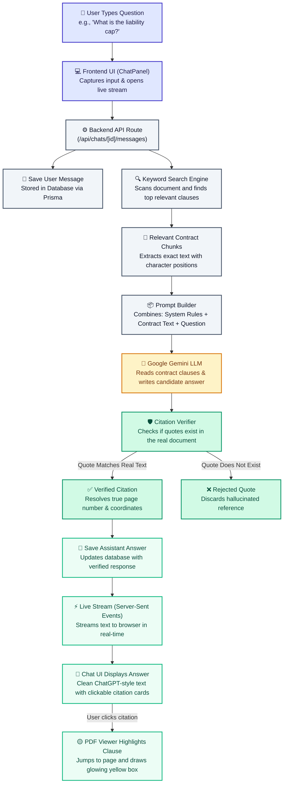

# 1. System Overview & Backend Flowchart

This flowchart shows the complete step-by-step path of how ContractAI works in the backend—from the moment a user asks a question to when the verified answer appears on screen.

---

## Visual Flowchart

---

## Mermaid Diagram Code

---

## Step-by-Step Breakdown

1. **User Types Input**: The user enters a question into the chat panel in their browser.
2. **Backend Receives Request**: Next.js route handler validates the request and immediately saves the question in the database.
3. **Smart Search**: The backend searches the indexed contract text to find the most relevant sections and clauses.
4. **Sent to LLM**: The contract clauses, the user's question, and strict legal formatting rules are packaged and sent to Google Gemini LLM.
5. **Zero-Trust Verification**: When the LLM replies with quotes, the backend independently verifies that every quote exists character-for-character in the original contract.
6. **Streaming Response**: The verified answer and clickable citation badges are streamed back to the browser in real time.
7. **Document Highlighting**: When the user clicks any citation, the document viewer smoothly jumps to that exact page and highlights the clause in glowing yellow.
