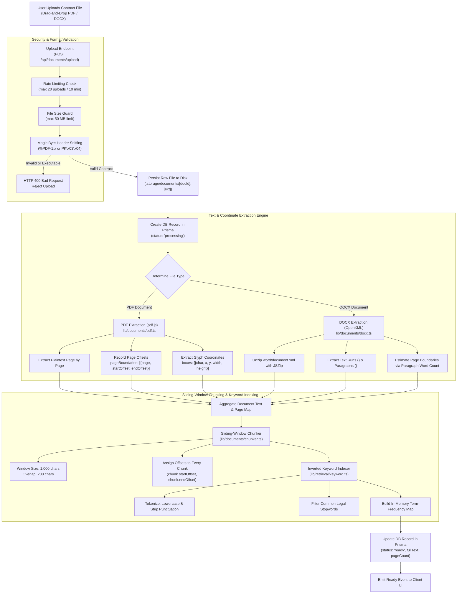
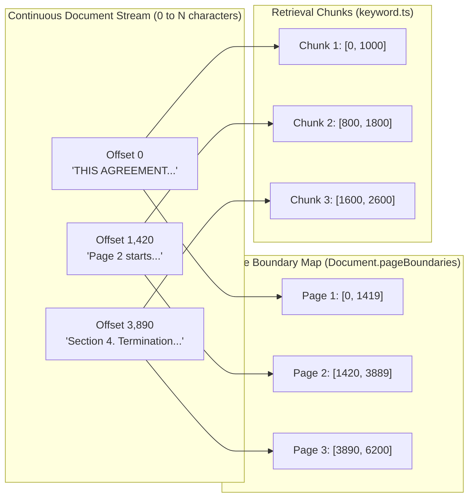
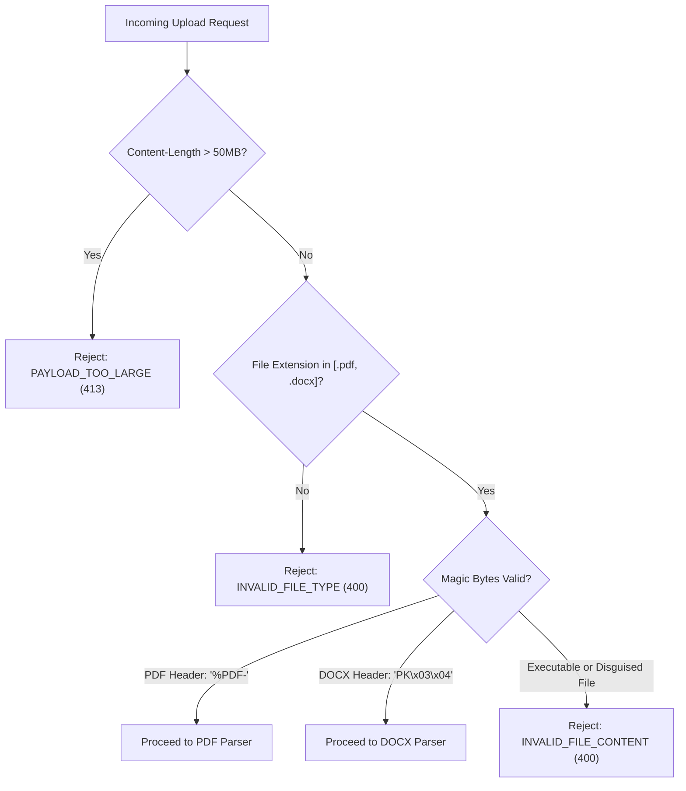

# Document Ingestion, Parsing & Coordinate Mapping Pipeline

This document explains how user-uploaded contracts (PDF and DOCX) are ingested, validated, parsed into character streams, mapped to physical page coordinates, chunked, and indexed for instantaneous retrieval.

---

## 1. Document Ingestion Flowchart

---

## 2. Character Offset & Page Coordinate Architecture

A critical architectural feature of ContractAI is that **every single character in a contract has a deterministic global offset `[0 ... N]`**. This enables sub-millisecond conversion between plain text quotes, database search chunks, and physical visual boxes on a PDF canvas.

### Why Character Offsets Matter for Citation Accuracy:
1. **Zero Guesswork**: The LLM is never allowed to guess page numbers. When the LLM quotes `"thirty (30) days"`, the backend locates the quote at character offset `3,912`.
2. **Deterministic Page Resolution**: By binary-searching the `pageBoundaries` array, offset `3,912` immediately maps to **Page 3** with mathematical certainty.
3. **Canvas Highlight Sync**: The PDF viewer matches offset `3,912` to the extracted glyph coordinate boxes `(x, y, w, h)` and paints the glowing yellow-gold bounding rectangle at the exact millimeter on screen.

---

## 3. Security & Validation Rules

To prevent malicious uploads and maintain regulatory compliance, the ingestion pipeline enforces strict defense-in-depth rules:

---

## 4. Source Code Cross-References

- **Upload Handler**: [app/api/documents/upload/route.ts](file:///Users/mahir/Downloads/contract-ai/app/api/documents/upload/route.ts)
- **PDF Extraction**: [lib/documents/pdf.ts](file:///Users/mahir/Downloads/contract-ai/lib/documents/pdf.ts)
- **DOCX Extraction**: [lib/documents/docx.ts](file:///Users/mahir/Downloads/contract-ai/lib/documents/docx.ts)
- **Chunking Engine**: [lib/documents/chunker.ts](file:///Users/mahir/Downloads/contract-ai/lib/documents/chunker.ts)
- **Storage Layer**: [lib/documents/storage.ts](file:///Users/mahir/Downloads/contract-ai/lib/documents/storage.ts)
