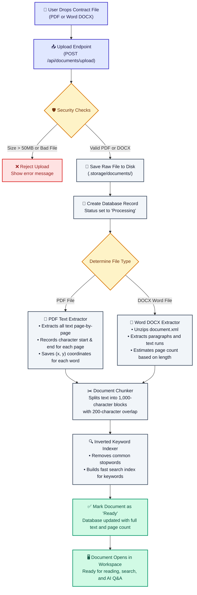

# 2. Document Ingestion Flowchart

This flowchart shows how contracts (PDF and Word documents) are uploaded, checked for security, converted into searchable text, and indexed for fast search.

---

## Visual Flowchart

---

## Mermaid Diagram Code

---

## Step-by-Step Breakdown

1. **User Uploads File**: Drag-and-drop a PDF or Word document into the library.
2. **Security & Validation**: Checks file size (max 50 MB) and verifies the file header so executables or corrupted files are immediately rejected.
3. **Save to Storage**: The original contract is safely stored in local disk storage.
4. **Text & Page Coordinate Extraction**:
   - For **PDF**: Reads text page-by-page and stores word coordinates so highlights can be drawn later.
   - For **DOCX**: Unzips the Word XML package and extracts text paragraphs.
5. **Sliding-Window Chunking**: Splits large documents into small 1,000-character chunks with overlap so no sentences or clauses get cut in half.
6. **Search Indexing**: Prepares a fast search index so questions find matching clauses in milliseconds.
7. **Ready for Use**: The document is marked "Ready" and opens in the viewer.
