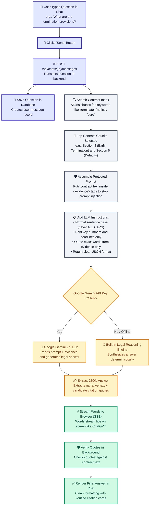

# 3. User Input to LLM & Response Flowchart

This flowchart shows exactly what happens after the user types a question: how the backend searches for clauses, builds the prompt, calls Google Gemini LLM, and streams the answer back.

---

## Visual Flowchart

---

## Mermaid Diagram Code

---

## Step-by-Step Breakdown

1. **User Types Question**: Enter any contract question (e.g., notice periods, liability caps, payment terms).
2. **Backend Finds Relevant Clauses**: The keyword search engine immediately locates the specific pages and sections that mention those terms.
3. **Prompt Sandbox**: The contract text is enclosed in `<evidence>` tags so malicious instructions in a document cannot trick the AI.
4. **Google Gemini Generates Answer**: Gemini analyzes the contract evidence, writes a structured explanation in normal sentence case, and selects exact quote candidates.
5. **Real-Time Streaming**: Words appear on the user's screen in real time with selective bolding on important deadlines (e.g., **thirty (30) days**).
