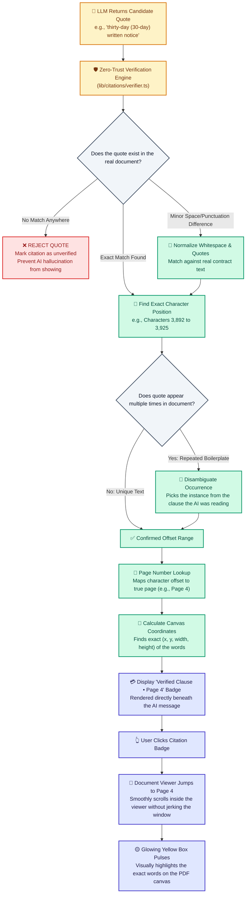

# 4. Zero-Trust Citation Verification Flowchart

This flowchart shows how ContractAI guarantees zero hallucinations: the AI is **never trusted** for page numbers or quote validity. Every quote must pass a strict verification check against the actual contract text.

---

## Visual Flowchart

---

## Mermaid Diagram Code

---

## Step-by-Step Breakdown

1. **AI Proposes a Quote**: The AI provides a snippet it claims is from the contract.
2. **Strict Verification**: The backend searches the actual raw document text to verify the words exist character-for-character.
3. **Hallucination Prevention**: If the model fabricated the quote or misquoted the contract, the verification engine rejects it.
4. **Repeated Phrase Disambiguation**: If common words like *"30 days"* appear on 5 different pages, the engine checks which section the AI was analyzing to select the right one.
5. **Exact Page & Coordinates**: The backend maps the quote's character position to the exact page number and bounding box.
6. **One-Click Inspection**: When you click the badge in chat, the document viewer jumps straight to the page and pulses a glowing yellow box around the exact text.
