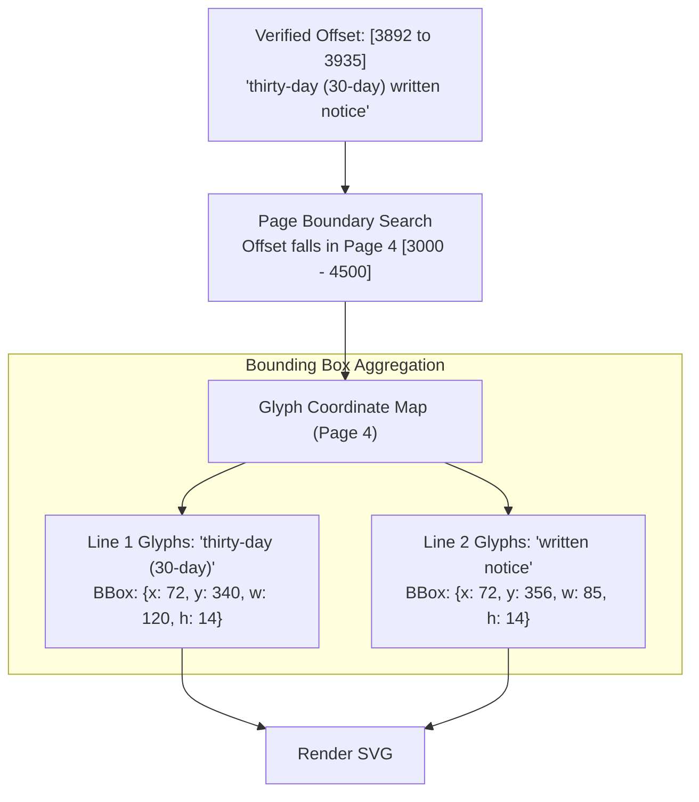
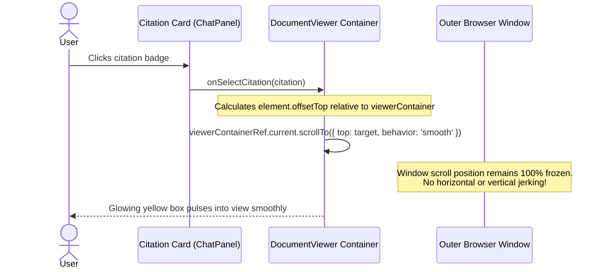

# Zero-Trust Citation Verification & Canvas Highlighting Pipeline

In legal AI, hallucinations and fabricated references create unacceptable liability. ContractAI enforces a **Zero-Trust Verification Pipeline**: the AI model generates candidate quotes, but application code is the sole authority for quote existence, character offsets, physical page numbers, and bounding-box coordinates.

---

## 1. Zero-Trust Verification Flowchart

```mermaid
flowchart TD
    LLM["LLM Generates Candidate Citations<br/>[{ quote: 'thirty-day (30-day) written notice', documentId: 'doc_1' }]"] --> Verifier["Verification Pipeline<br/>(lib/citations/verifier.ts)"]

    subgraph Phase1["Phase 1: Verbatim & Normalized Text Search"]
        Verifier --> ExactSearch{"Exact Character Match in doc.fullText?"}
        ExactSearch -->|Found| RecordMatch["Record Raw Match Index"]
        ExactSearch -->|Not Found| NormSearch["Whitespace & Smart-Quote Normalization<br/>(collapse whitespace, match ' vs ', — vs -)"]
        NormSearch --> NormMatch{"Normalized Match Found?"}
        NormMatch -->|Found| MapBack["Map Back to Original Document Offsets"]
        NormMatch -->|Not Found| RejectQuote["Mark Verified = FALSE<br/>Reject or Quarantine Citation"]
    end

    subgraph Phase2["Phase 2: Contextual Disambiguation"]
        RecordMatch & MapBack --> MultiMatch{"Multiple Occurrences in Document?"}
        MultiMatch -->|Single Occurrence| UniqueOffset["Set targetOffset = match.startOffset"]
        MultiMatch -->|Repeated Quote (e.g. '30 days')| Disambiguate["Disambiguate via Retrieved Chunks<br/>Match against allowedRanges of chunks LLM reviewed"]
        Disambiguate --> ClusteredOffset["Select Occurrence Closest to Relevant Section"]
    end

    subgraph Phase3["Phase 3: Page & Coordinate Resolution"]
        UniqueOffset & ClusteredOffset --> PageLookup["Binary Search in doc.pageBoundaries<br/>Find Page where: startOffset <= offset <= endOffset"]
        PageLookup --> AssignPage["Assign True pageNumber (e.g. Page 4)"]
        AssignPage --> CoordEngine["Coordinate Engine (lib/citations/coordinates.ts)<br/>Map offsets to Character Glyph Bounding Boxes"]
        CoordEngine --> Boxes["Generate Canvas Boxes: [{x, y, width, height}]"]
    end

    subgraph Phase4["Phase 4: Frontend Highlighting"]
        Boxes --> CitationCard["Render Verified Citation Badge in ChatPanel<br/>'Verified Clause • Page 4'"]
        CitationCard -->|User Clicks Badge| JumpAction["Viewer Action: onSelectCitation(...)"]
        JumpAction --> ViewerScroll["Scoped Viewer Scroll (DocumentViewer.tsx)<br/>Smooth scroll viewerContainerRef to target page"]
        ViewerScroll --> DrawSVG["Paint SVG Overlay Layer<br/>Apply 'citation-highlight-active' Glowing Pulse"]
    end
```

---

## 2. Handling Edge Cases in Legal Verification

Legal contracts present severe text matching challenges that cause traditional AI tools to fail. ContractAI's verification engine handles each case deterministically:

```mermaid
graph LR
    subgraph EdgeCases["Contract Text Challenges"]
        EC1["Multi-line Hyphenated Words<br/>e.g. 'ter- \n mination'"]
        EC2["Repeated Common Boilerplate<br/>e.g. 'thirty (30) days' on 6 pages"]
        EC3["Page Boundary Spans<br/>Quote starts page 2, ends page 3"]
        EC4["Smart Quotes & Unicode Dashes<br/>'“quote”' vs '\"quote\"'"]
    end

    subgraph VerifierSolution["ContractAI Deterministic Handling"]
        VS1["Regex-based whitespace and line break collapse"]
        VS2["Scope matching to chunk's allowedRanges"]
        VS3["Calculate pageStart and pageEnd boundary span"]
        VS4["Dual-pass character normalization mapping"]
    end

    EC1 --> VS1
    EC2 --> VS2
    EC3 --> VS3
    EC4 --> VS4
```

---

## 3. Physical Page Coordinate Mapping

When a PDF is rendered, the text is represented as vector paths or glyphs on a 72-DPI coordinate plane. The verification engine translates character offsets into canvas pixel rectangles:



---

## 4. Why UI Viewport Scrolling Is Scoped

To eliminate viewport jerking where clicking a citation previously scrolled the entire browser window down, scrolling is constrained strictly to the inner viewer container:



---

## 5. Source Code Cross-References

- **Citation Verifier**: [lib/citations/verifier.ts](file:///Users/mahir/Downloads/contract-ai/lib/citations/verifier.ts)
- **Bounding Box Coordinates**: [lib/citations/coordinates.ts](file:///Users/mahir/Downloads/contract-ai/lib/citations/coordinates.ts)
- **Interactive Viewer**: [components/DocumentViewer.tsx](file:///Users/mahir/Downloads/contract-ai/components/DocumentViewer.tsx)
- **Verified Badge UI**: [components/ChatPanel.tsx](file:///Users/mahir/Downloads/contract-ai/components/ChatPanel.tsx)
