# 5. Agentic Deep Research & Redlining Flowcharts

This document provides clean flowcharts for two advanced features: **Autonomous Agentic Research** (Part C Option 2) and **Tracked-Change Redlining in Word** (Part C Option 1).

---

## Visual Flowchart


---

## Mermaid Diagram Code

### Flowchart 1: Autonomous Agentic Research Loop

```mermaid
flowchart TD
    %% 1. Start
    A["👤 User Starts Agent Deep Research<br/>e.g., 'Compare liability caps, indemnities, and termination risks'"] --> B["⚙️ POST /api/agent/research"]
    B --> C["🤖 Agent Initializes ReAct Loop<br/>Sets round = 1 (Max 5 rounds)"]

    %% 2. Agent Decision
    C --> D["🧠 Model Analyzes Progress & Chooses Action"]
    
    %% 3. Tool Choice
    D -->|Needs more information| E{"Select Contract Tool"}
    E -->|Search Keywords| F["🔍 search_document()<br/>Finds mentions across entire contract"]
    E -->|Read Clause| G["📖 get_section()<br/>Reads full text of Section 4 or 6"]
    E -->|Table of Contents| H["📑 list_clauses()<br/>Lists all document headings"]

    %% 4. Tool Execution
    F & G & H --> I["⚡ Execute Tool & Stream Step to User<br/>Chat shows step: 'Searching document for indemnity...'"]
    I --> J["➕ Append Findings to Agent Memory"]
    J --> K{"Reached 5 Rounds or Found Answer?"}
    
    K -->|Need more evidence (Rounds < 5)| D
    K -->|Enough Evidence Gathered| L["📝 Synthesize Final Comprehensive Report"]
    
    %% 5. Verification & Display
    L --> M["🛡️ Verify All Citations<br/>Passes quotes through Zero-Trust Verifier"]
    M --> N["✅ Render Final Report in Chat<br/>Displays expandable research steps + verified quotes"]

    %% Styling
    classDef startNode fill:#e0e7ff,stroke:#4338ca,stroke-width:2px,color:#1e1b4b;
    classDef loopNode fill:#fef3c7,stroke:#d97706,stroke-width:2px,color:#78350f;
    classDef toolNode fill:#f1f5f9,stroke:#475569,stroke-width:2px,color:#0f172a;
    classDef finishNode fill:#d1fae5,stroke:#059669,stroke-width:2px,color:#064e3b;

    class A,B startNode;
    class C,D,J,K loopNode;
    class E,F,G,H,I toolNode;
    class L,M,N finishNode;
```

---

## Flowchart 2: Tracked-Change Redlining (Word DOCX)

```mermaid
flowchart TD
    %% 1. User Instruction
    A["👤 User Enters Redline Request<br/>e.g., 'Increase termination notice from 30 to 60 days'"] --> B["⚙️ Propose Endpoint (POST /api/redline)"]

    %% 2. Surgical Identification
    B --> C["🔍 AI Locates Targeted Clause<br/>Finds exact text: 'thirty-day (30-day)'"]
    C --> D["✏️ Proposes Exact Replacement<br/>Replacement text: 'sixty-day (60-day)'"]
    D --> E["🛡️ Verifies Target Exists in Document<br/>Ensures surrounding text remains 100% untouched"]

    %% 3. In-Browser Preview
    E --> F["🖥️ Displays Visual Diff Preview in Browser<br/>~~thirty-day (30-day)~~ in RED<br/><u>sixty-day (60-day)</u> in GREEN"]
    
    %% 4. User Approval & Download
    F --> G["📥 User Clicks 'Download Redlined DOCX'"]
    G --> H["⚙️ Apply Endpoint (POST /api/redline/apply)"]

    %% 5. Native OpenXML Modification
    H --> I["📂 Unzips Word Document (JSZip)<br/>Opens word/document.xml"]
    I --> J["🏷️ Injects Native Tracked Changes Markup:<br/>• &lt;w:del&gt; for deleted words<br/>• &lt;w:ins&gt; for inserted words<br/>• Adds author='ContractAI' and date"]
    J --> K["📦 Re-packages Clean .docx File"]

    %% 6. Review in Word
    K --> L["💾 Download 'redlined-contract.docx'"]
    L --> M["📑 Open in Microsoft Word or LibreOffice<br/>Native 'Accept' and 'Reject' buttons work instantly!"]

    %% Styling
    classDef inputNode fill:#e0e7ff,stroke:#4338ca,stroke-width:2px,color:#1e1b4b;
    classDef parseNode fill:#fef3c7,stroke:#d97706,stroke-width:2px,color:#78350f;
    classDef previewNode fill:#f1f5f9,stroke:#475569,stroke-width:2px,color:#0f172a;
    classDef docxNode fill:#d1fae5,stroke:#059669,stroke-width:2px,color:#064e3b;

    class A,B inputNode;
    class C,D,E parseNode;
    class F,G previewNode;
    class H,I,J,K,L,M docxNode;
```



---

## Step-by-Step Breakdown

### Agentic Research Loop
1. **Multi-Step Goal**: The user asks a high-level question covering multiple contract areas.
2. **Autonomous Tool Selection**: The AI decides whether to search keywords, inspect a specific section, or read the clause index.
3. **5-Round Safety Cap**: Hard loop limit guarantees the agent will never loop endlessly or overspend tokens.
4. **Final Grounded Report**: Synthesizes the collected evidence and verifies all citations before displaying the result.

### Word Tracked-Change Redlining
1. **Plain-English Edit**: Request edits in everyday language without needing legal formatting.
2. **Surgical Replacement**: The engine changes only the exact target words without corrupting formatting, headers, or tables.
3. **In-Browser Review**: Review struck-through red deletions and underlined green additions in context.
4. **Real Word `.docx` File**: Downloads a file with real Microsoft Word tracked changes enabled so lawyers can review, accept, or reject the edit.
