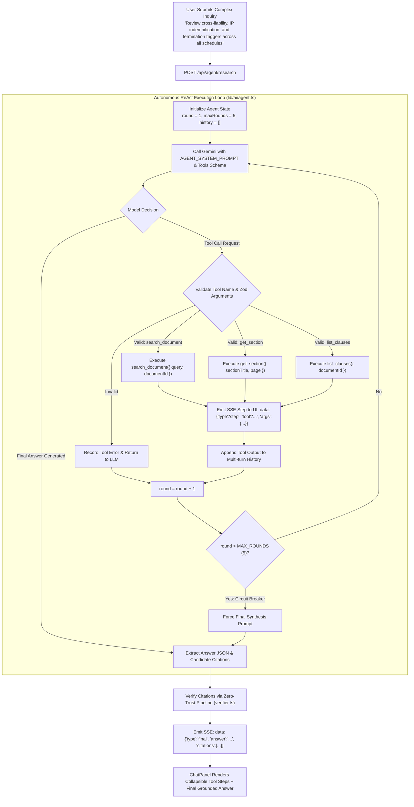
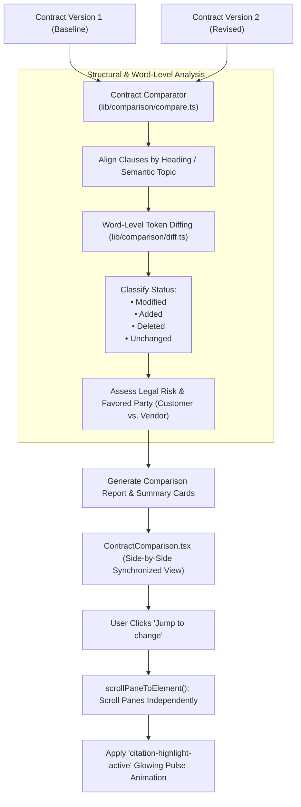

# Agentic Deep Research & Tracked-Change Redlining Pipelines

This document covers the advanced workflows of **ContractAI** (Part C of the PRD): the **Autonomous Agentic Deep Research loop** (Option 2) and the **Native OpenXML Tracked-Change Redlining & Comparison Engine** (Option 1).

---

## 1. Autonomous Agentic Research Loop (Part C: Option 2)

Unlike single-turn Q&A, the Agentic Research loop iteratively reasons, chooses tools to inspect specific contract sections, evaluates evidence, and terminates autonomously when sufficient evidence has been gathered.

### Agentic Loop Safety Protections:
- **Hard Round Limit**: Capped at 5 rounds to prevent runaway costs or infinite API loops.
- **Strict Schema Validation**: Tool names and arguments are validated via Zod schemas; malformed calls are trapped and fed back as descriptive error strings.
- **Equal Citation Standard**: The agent's final answer must pass the exact same zero-trust verification pipeline as standard chat messages.

---

## 2. Tracked-Change Redlining Pipeline (Part C: Option 1)

```mermaid
flowchart TD
    User["User Instruction<br/>'Increase termination notice from 30 to 60 days'"] --> ProposalAPI["POST /api/redline"]
    
    subgraph Step1["Step 1: Surgical Proposal Engine (lib/redline/propose.ts)"]
        ProposalAPI --> PromptLLM["Prompt Gemini / Legal Rule Engine"]
        PromptLLM --> ExtractFields["Extract:<br/>- targetText: 'thirty-day (30-day)'<br/>- revisedText: 'sixty-day (60-day)'<br/>- contextSentence: Full operative clause<br/>- clauseTitle: Section 4.A Term & Termination"]
        ExtractFields --> VerifyInDoc{"targetText exists verbatim in contract?"}
        VerifyInDoc -->|No| FallbackRule["Use Deterministic Regex Legal Fallback"]
        VerifyInDoc -->|Yes| ReturnProposal["Return JSON Proposal"]
        FallbackRule --> ReturnProposal
    end

    ReturnProposal --> UIPreview["RedlinePanel.tsx: In-Browser Diff Preview<br/>Renders ~~thirty-day~~ and <u>sixty-day</u>"]

    UIPreview -->|User Clicks 'Download Redlined DOCX'| ApplyAPI["POST /api/redline/apply"]

    subgraph Step2["Step 2: Native WordprocessingML Injection (lib/redline/docxXml.ts)"]
        ApplyAPI --> Unzip["Unpack .docx Archive via JSZip"]
        Unzip --> ReadXML["Read word/document.xml"]
        ReadXML --> SearchRuns["Handle Run Fragmentation (<w:r> & <w:t> tags)"]
        
        SearchRuns --> InjectTags["Inject OpenXML Markup:<br/>&lt;w:del w:author='ContractAI' w:date='...'&gt;<br/>  &lt;w:delText&gt;thirty-day (30-day)&lt;/w:delText&gt;<br/>&lt;/w:del&gt;<br/>&lt;w:ins w:author='ContractAI' w:date='...'&gt;<br/>  &lt;w:t&gt;sixty-day (60-day)&lt;/w:t&gt;<br/>&lt;/w:ins&gt;"]
        
        InjectTags --> Repack["Repack Zip Archive into Buffer"]
    end

    Repack --> Download["Deliver Downloadable DOCX File<br/>(attachment: redlined-SampleContract.docx)"]
    Download --> WordApp["Lawyer Opens File in Microsoft Word or LibreOffice<br/>Full formatting preserved + Native Accept/Reject UI enabled"]
```

Traditional AI editors simply generate new text, destroying document layout, fonts, and numbering. ContractAI's redlining pipeline generates **native Microsoft Word OpenXML tracked changes** (`<w:del>` and `<w:ins>`) that lawyers can review using Word's native **Accept / Reject** buttons.

---

## 3. Contract Comparison & Diff Architecture

When comparing two contracts or versions (e.g., Version 1 vs. Version 2), ContractAI analyzes structural clause changes and performs word-level token diffing:

---

## 4. Source Code Cross-References

- **Autonomous Agent Loop**: [lib/ai/agent.ts](file:///Users/mahir/Downloads/contract-ai/lib/ai/agent.ts)
- **Agent Tools Implementation**: [lib/ai/tools.ts](file:///Users/mahir/Downloads/contract-ai/lib/ai/tools.ts)
- **Agent Research API Route**: [app/api/agent/research/route.ts](file:///Users/mahir/Downloads/contract-ai/app/api/agent/research/route.ts)
- **Redline Propose Route**: [app/api/redline/route.ts](file:///Users/mahir/Downloads/contract-ai/app/api/redline/route.ts)
- **Redline Apply Route**: [app/api/redline/apply/route.ts](file:///Users/mahir/Downloads/contract-ai/app/api/redline/apply/route.ts)
- **OpenXML DOCX Engine**: [lib/redline/docxXml.ts](file:///Users/mahir/Downloads/contract-ai/lib/redline/docxXml.ts)
- **Contract Comparison Engine**: [lib/comparison/compare.ts](file:///Users/mahir/Downloads/contract-ai/lib/comparison/compare.ts)
